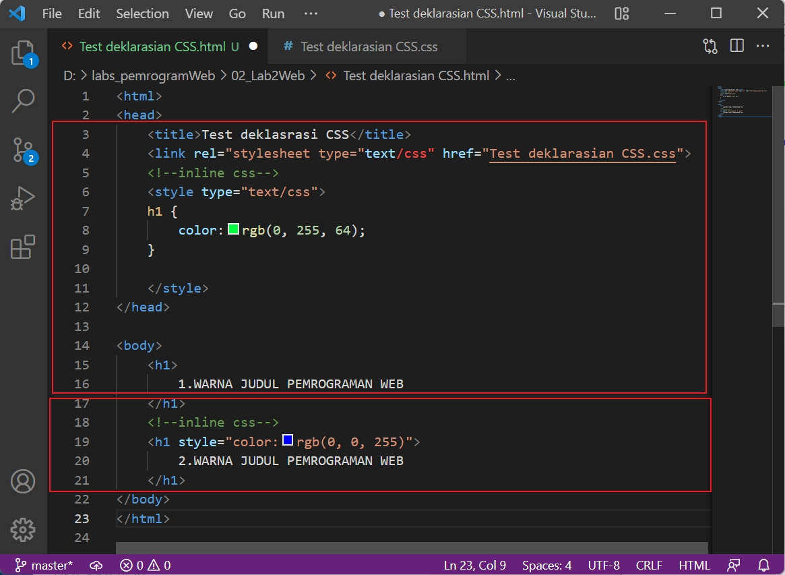

# 02_Lab2Web
TUGAS PERTEMUAN 3

PEMROGRAMAN WEB

TEKNIK INFORMATIKA

UNIVERSITAS PELITA BANGSA

NAMA  : GUNAWAN

NIM   : 312010191

KELAS : TI.20.B1

DOSEN : Agung Nugroho,S.Kom.,M.Kom

**Praktikum 2: CSS Dasar**

**Instruksi Praktikum**
1. Persiapkan text editor misalnya VSCode.
2. Buat file baru dengan nama lab2_css_dasar.html
3. Buat struktur dasar dari dokumen HTML.
4. Ikuti langkah-langkah praktikum yang akan dijelaskan berikutnya.
5. Lakukan validasi dokumen css dengan mengakses https://jigsaw.w3.org/css-validator/5. 

**Langkah-langkah Praktikum** 
**1. Membuat dokumen HTML** 
Buatlah dokumen HTML seperti berikut: 

Selanjutnya buka pada brwoser untuk melihat hasilnya.

Gambar 01.Tampilan Dokumen HTML

**2. Mendeklarasikan CSS Internal**

Kemudian tambahkan deklarasi CSS internal seperti berikut pada bagian head dokumen.

Selanjutnya simpan perubahan yang ada, dan lakukan refresh pada browser untuk melihat
hasilnya.

Gambar 02. Penambahan CSS pada HTML

**3. Menambahkan Inline CSS**

Kemudian tambahkan deklarasi inline CSS pada tag ``
`` seperti berikut.

   ``
``
   
 

Simpan kembali dan refresh kembali browser untuk melihat perubahannya.

Gambar 03. Penambahan Inline CSS

**4. Membuat CSS Eksternal**

Buatlah file baru dengan nama **style_eksternal.css** kemudian buatlah deklarasi CSS seperti berikut.

Kemudian tambahkan tag ``<link>`` untuk merujuk file css yang sudah dibuat pada bagian ``<head>``

>``<head>`` 
>``<!-- menyisipkan css eksternal -->`` 
>``<link rel="stylesheet" ``
>``href="style_eksternal.css" type="text/css">`` 
>``</head>``

Selanjutnya refresh kembali browser untuk melihat perubahannya.

Gambar 04. Tampilan Eksternal CSS

**5. Menambahkan CSS Selector**

Selanjutnya menambahkan CSS Selector menggunakan ID dan Class Selector. Pada file
**style_eksternal.css**, tambahkan kode berikut.

Kemudian simpan kembali dan refresh browser untuk melihat perubahannya.

Gambar 05. CSS ID dan Class Selector

# Pertanyaan dan Tugas

1. Lakukan eksperimen dengan mengubah dan menambah properti dan nilai pada kode CSS
dengan mengacu pada CSS Cheat Sheet yang diberikan pada file terpisah dari modul ini.
>**Jawab:**
> Eksperimen dengan mengubah dan menambah properti dan nilai pada kode CSS :
> 
>Berikut tampilan pada Browser setelah di ubah nilai padaCSS :
> 
2. Apa perbedaan pendeklarasian CSS elemen h1 {...} dengan #intro h1 {...}? berikan
penjelasannya!
>**Jawab:**
>Perbedaaannya jika hanya h1{} maka akan merubah semua yang ada didalam elemen h1, sedangkan #intro h1{} hanya akan merubah yang memiliki tag intro.
3. Apabila ada deklarasi CSS secara internal, lalu ditambahkan CSS eksternal dan inline CSS pada
elemen yang sama. Deklarasi manakah yang akan ditampilkan pada browser? Berikan penjelasan dan contohnya!

>**Jawab:**
>jika ketiga CSS merubah elemen yang sama maka deklarasi tersebut akan mengikuti aturan prioritas dimana prioritas CSS nya seperti ini:
>1. inline CSS
>2. ID selector CSS
>3. internal CSS
>4. external CSS 
>contoh:
>ini adalah tampilan coding pada html testing dimana terdapat 2 kalimat yang memiliki elemen yang sama yaitu h1: 
>**Disini bisa dilihat sudah terdapat 2 css mencoba merubah warna text h1 :**
> 
>Sedangkan eksternal css berupa :
> 
>Dan hasil Tampilan Pada Browser adalah :
> 
>**jadi kesimpulan yaitu semakin spesifik CSS tersebut maka prioritas semakin tinggi**

4. Pada sebuah elemen HTML terdapat ID dan Class, apabila masing-masing selector tersebut
terdapat deklarasi CSS, maka deklarasi manakah yang akan ditampilkan pada browser?
Berikan penjelasan dan contohnya! ``( 
 )``
>**Jawab:**
>Hasilnya sesuai dengan kesimpulan saya sebelumnya semakin spesifik css tersebut maka akan semakin tinggi prioritas css tersebut :
> 

Disitu bisa dilihat terdapat 2 css yang merujuk ke elemen yang sama tapi 1 merujuk dengan id yang birisi **font 50px dan warna blueviolet** sedangkan yang satu lagi merujuk dengan class yang berisi **font 10px dan warna magenta**: 
> 

>Berikut tampilan Pada Browser :
> 
>Text **"3. GUNAWAN TUGAS 2 PEMROGRAMAN WEB"** tersebut mengikuti css **selector id** dari pada **selector class** dikarenakan **id lebih spesifik daripada class**.

Cukup sekian Penjelasan dari saya.

**Terimakasih**
 

